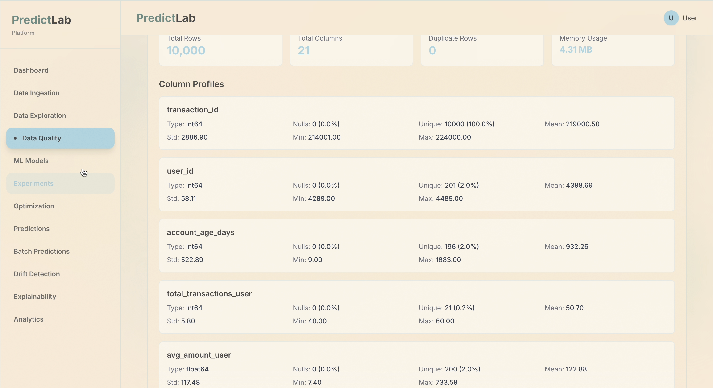

# Automated Predictive Modeling Platform

This website implementation has limited functionality due to hosting costs. Full features require monthly hosting fees for multiple background services (Redis, Celery workers, MLflow, etc.) that are not currently deployed. Basic authentication and API endpoints work, but intensive features like model training, real-time updates, experiment tracking, and batch processing are unavailable without these paid services.

Next.js and FastAPI web application that provides automated machine learning model training, deployment, and monitoring with real-time predictions and explainability features.

## Screenshots

## What It Does

**Automated ML Pipeline**: End-to-end machine learning workflow from data ingestion to model deployment

**Data Ingestion**: Upload CSV files, connect to APIs, or scrape web data with automated ETL processing

**Model Training**: Train regression, classification, and anomaly detection models with automated preprocessing and feature engineering

**Real-time Predictions**: Generate predictions from trained models with single or batch processing

**Model Explainability**: Understand model decisions with SHAP, LIME, and feature importance visualizations

**Model Monitoring**: Track model performance, detect data drift, and monitor prediction quality over time

**Experiment Tracking**: Compare model versions, track hyperparameters, and analyze training metrics

**Hyperparameter Optimization**: Automated hyperparameter tuning using Optuna with various search strategies

**Batch Processing**: Process large datasets with background jobs and download results

**User Dashboard**: View statistics, model performance, training history, and system metrics

**API Access**: Programmatic access via REST API with authentication and API key management

## How It Works

**Data Ingestion**: Users upload CSV files or configure API/web scraping sources, which are processed through ETL pipelines

**Automated Preprocessing**: System automatically handles missing values, encoding, scaling, and feature engineering

**Model Training**: Training jobs run asynchronously using Celery workers, with progress updates via WebSocket

**Model Storage**: Trained models are stored in cloud storage (S3/Azure) or locally, with versioning and metadata tracking

**Real-time Inference**: Fast prediction API endpoints serve models with caching and rate limiting

**Explainability**: SHAP and LIME explainers analyze model predictions to show feature contributions

**Drift Detection**: Statistical tests monitor data distribution changes and alert on model degradation

**Progress Tracking**: WebSocket connections provide real-time updates on training jobs and batch processing

**Database**: PostgreSQL with TimescaleDB stores all data, models, predictions, and metadata

**Caching**: Redis caches API responses and rate limit counters for improved performance

## Controls

**Dashboard**: View overview of data sources, models, training jobs, and system statistics

**Data Ingestion**: Upload CSV files, configure API sources, or set up web scraping jobs

**Model Training**: Configure training parameters, select algorithms, and start training jobs with real-time progress

**Predictions**: Make single predictions or upload batch files for processing

**Batch Predictions**: Upload CSV files for batch processing, track job status, and download results

**Model Management**: View all models, compare versions, retrain models, and manage deployments

**Explainability**: Analyze model predictions with SHAP waterfall charts, LIME explanations, and feature importance

**Experiments**: Browse MLflow experiments, compare runs, and analyze training metrics

**Drift Monitoring**: View drift reports, check data quality, and monitor model performance over time

**Data Quality**: Generate data profiles, check data lineage, and run quality assessments

**Settings**: Manage API keys, view account information, and configure preferences

**Navigation**: Switch between Dashboard, Data Ingestion, Models, Predictions, Experiments, Explainability, Drift, and Settings

**Note**: Full functionality requires paid hosting services (Redis, Celery workers, MLflow) for background processing and real-time features.

## Dependencies

### Frontend

- **next** - React framework with App Router
- **react** & **react-dom** - UI library
- **axios** - HTTP client for API requests
- **@supabase/supabase-js** - Authentication and database client (optional)
- **tailwindcss** - Utility-first CSS framework
- **recharts** - Chart and visualization library
- **framer-motion** - Animation library
- **lucide-react** - Icon library
- **typescript** - Type safety

### Backend

- **fastapi** - Python web framework
- **sqlalchemy** - Python ORM for database operations
- **alembic** - Database migration tool
- **pydantic** - Data validation
- **scikit-learn** - Machine learning library
- **xgboost** - Gradient boosting framework
- **catboost** - Gradient boosting with categorical features
- **lightgbm** - Gradient boosting framework
- **pandas** - Data manipulation
- **numpy** - Numerical computing
- **prefect** - Workflow orchestration
- **celery** - Distributed task queue
- **redis** - Caching and message broker
- **mlflow** - Experiment tracking (optional)
- **shap** - Model explainability
- **lime** - Model explainability
- **optuna** - Hyperparameter optimization
- **uvicorn** - ASGI server

## Technical Details

**Framework**: Next.js 14 (App Router) + FastAPI

**AI/ML**: scikit-learn, XGBoost, CatBoost, LightGBM for model training

**Inference**: Server-side model serving with FastAPI endpoints

**Database**: PostgreSQL 15+ with TimescaleDB extension

**Authentication**: JWT-based authentication with refresh tokens

**State Management**: React hooks + Context API

**Styling**: Tailwind CSS utility classes with custom design system

**API**: FastAPI REST endpoints with OpenAPI documentation

**Deployment**: Vercel (frontend) + Render (backend) + PostgreSQL (database)

**Background Jobs**: Celery workers with Redis message broker

**Real-time Updates**: WebSocket connections for training progress and batch job status

**Cloud Storage**: AWS S3 or Azure Blob Storage for model artifacts

## Features

- Automated data preprocessing and feature engineering
- Multiple ML algorithms (Random Forest, XGBoost, CatBoost, LightGBM, Neural Networks)
- Real-time single and batch predictions
- Model explainability (SHAP, LIME, Feature Importance)
- Data drift detection and monitoring
- Hyperparameter optimization with Optuna
- Experiment tracking with MLflow integration
- Model versioning and management
- Automated retraining pipelines
- Data quality profiling and validation
- A/B testing framework for models
- Alert system for model performance
- API key management for programmatic access
- User authentication and authorization
- Progress tracking and statistics dashboard
- WebSocket real-time updates
- Rate limiting and caching
- Comprehensive API documentation

## API Endpoints

### Authentication
- `POST /api/v1/auth/register` - Register new user
- `POST /api/v1/auth/login` - User login
- `POST /api/v1/auth/refresh` - Refresh access token
- `GET /api/v1/auth/me` - Get current user
- `POST /api/v1/auth/change-password` - Change password

### Data Ingestion
- `POST /api/v1/ingestion/upload` - Upload CSV file
- `POST /api/v1/ingestion/api-source` - Configure API data source
- `POST /api/v1/ingestion/scrape` - Configure web scraping
- `GET /api/v1/ingestion/sources` - List data sources
- `GET /api/v1/ingestion/sources/{id}` - Get data source details
- `DELETE /api/v1/ingestion/sources/{id}` - Delete data source

### Data Management
- `GET /api/v1/data/sources` - List all data sources
- `GET /api/v1/data/sources/{id}/preview` - Preview data source
- `GET /api/v1/data/sources/{id}/stats` - Get data statistics
- `DELETE /api/v1/data/points/{id}` - Delete data point

### ML Models
- `GET /api/v1/ml/models` - List all models
- `GET /api/v1/ml/models/{id}` - Get model details
- `POST /api/v1/ml/training` - Start model training
- `GET /api/v1/ml/training/{job_id}/status` - Get training status
- `GET /api/v1/ml/training` - Get training history
- `DELETE /api/v1/ml/models/{id}` - Delete model
- `POST /api/v1/ml/models/{id}/retrain` - Retrain model

### Predictions
- `POST /api/v1/ml/predictions` - Single prediction
- `POST /api/v1/ml/predictions/batch` - Batch predictions
- `POST /api/v1/ml/anomaly/detect` - Anomaly detection
- `POST /api/v1/ml/classification` - Classification prediction

### Batch Processing
- `POST /api/v1/ml/batch-predictions/upload` - Upload batch file
- `POST /api/v1/ml/batch-predictions` - Create batch job
- `GET /api/v1/ml/batch-predictions` - List batch jobs
- `GET /api/v1/ml/batch-predictions/{id}` - Get batch job status
- `GET /api/v1/ml/batch-predictions/{id}/download` - Download results
- `POST /api/v1/ml/batch-predictions/{id}/cancel` - Cancel batch job

### Explainability
- `POST /api/v1/ml/explain/shap` - SHAP explanation
- `POST /api/v1/ml/explain/lime` - LIME explanation
- `GET /api/v1/ml/explain/feature-importance/{id}` - Feature importance
- `POST /api/v1/ml/explain/feature-importance` - Calculate feature importance
- `POST /api/v1/ml/explain/waterfall` - SHAP waterfall data

### Experiments
- `GET /api/v1/ml/experiments` - List experiments
- `GET /api/v1/ml/experiments/{name}` - Get experiment details
- `POST /api/v1/ml/experiments/runs/search` - Search runs
- `GET /api/v1/ml/experiments/{name}/compare` - Compare runs

### Optimization
- `POST /api/v1/ml/optimize` - Start hyperparameter optimization
- `GET /api/v1/ml/optimize/{study_name}/summary` - Get optimization summary

### Drift Detection
- `POST /api/v1/ml/drift/check` - Check for data drift
- `GET /api/v1/ml/drift/{model_id}/reports` - Get drift reports
- `GET /api/v1/ml/drift/{model_id}/latest` - Get latest drift report

### Data Quality
- `GET /api/v1/data/quality/{data_source_id}/reports` - Get quality reports
- `GET /api/v1/data/quality/{data_source_id}/profile` - Get data profile
- `GET /api/v1/data/quality/{data_source_id}/lineage` - Get data lineage
- `POST /api/v1/data/quality/check` - Run quality check

### API Keys
- `GET /api/v1/api-keys` - List API keys
- `POST /api/v1/api-keys` - Create API key
- `DELETE /api/v1/api-keys/{id}` - Delete API key

### Health & Metrics
- `GET /health` - Health check endpoint
- `GET /metrics` - Prometheus metrics

**API documentation available at `/docs` when running backend.**

## Deployment

**Frontend**: Deployed on Vercel  
**Backend**: Deployed on Render  
**Database**: PostgreSQL on Render  
**Note**: Full functionality requires additional paid services (Redis, Celery workers, MLflow) for background processing.
