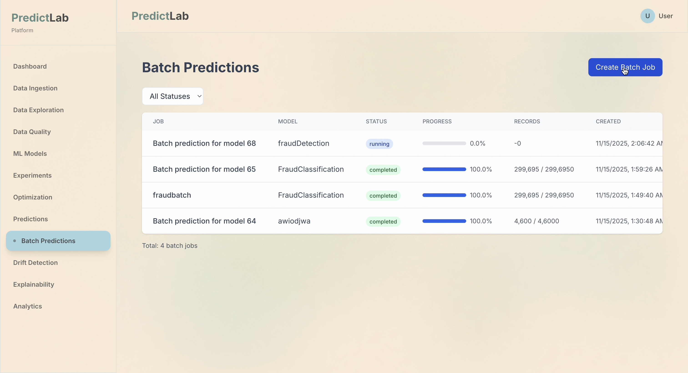
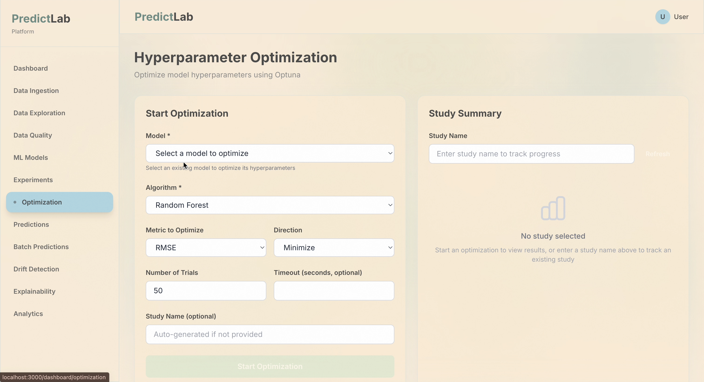
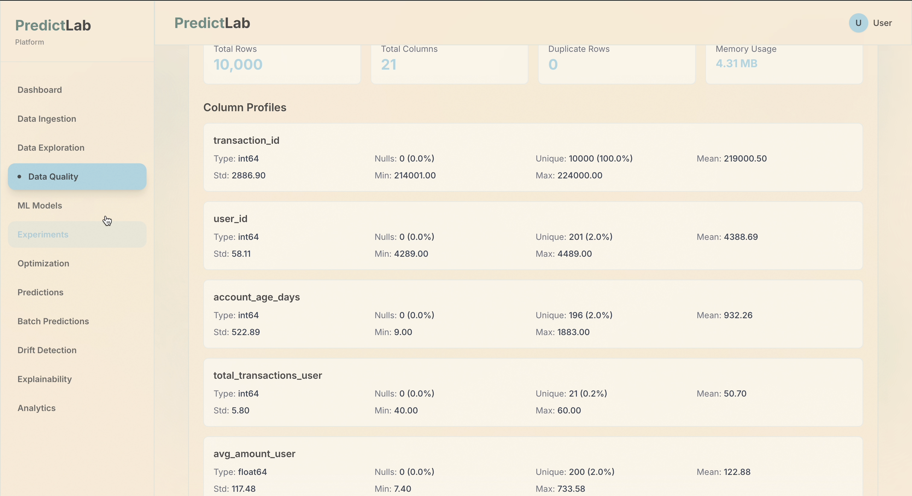
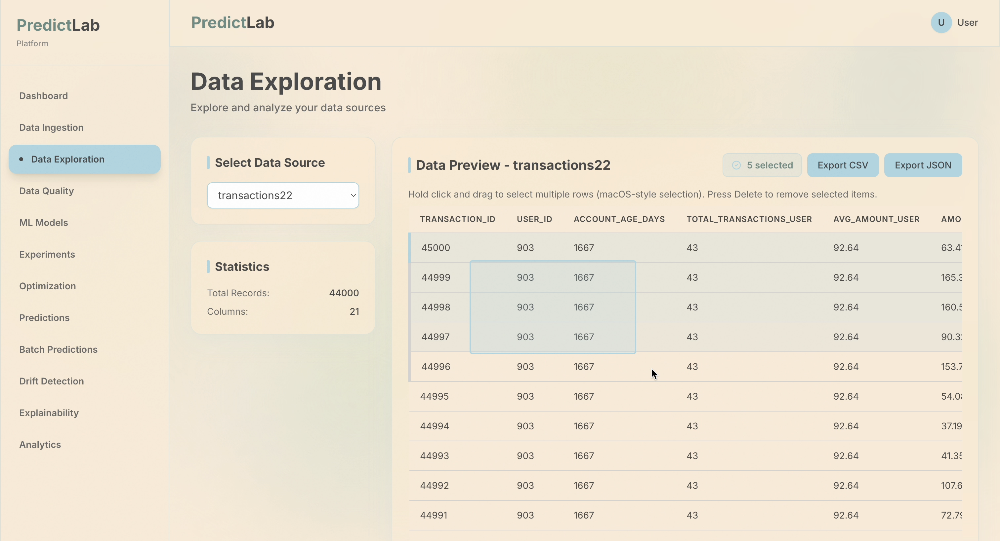
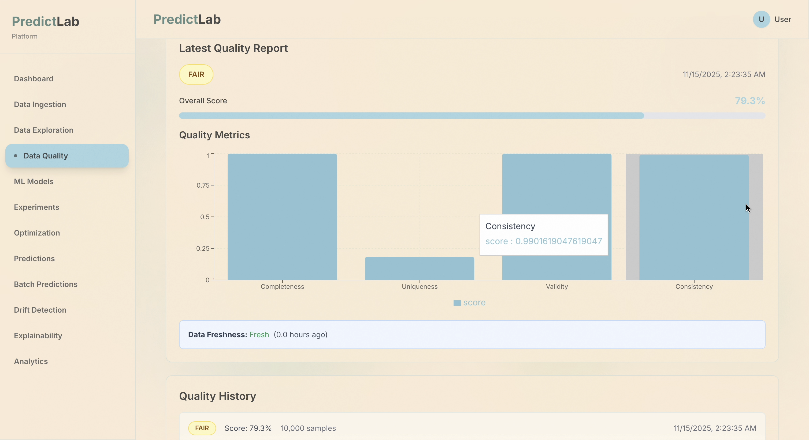
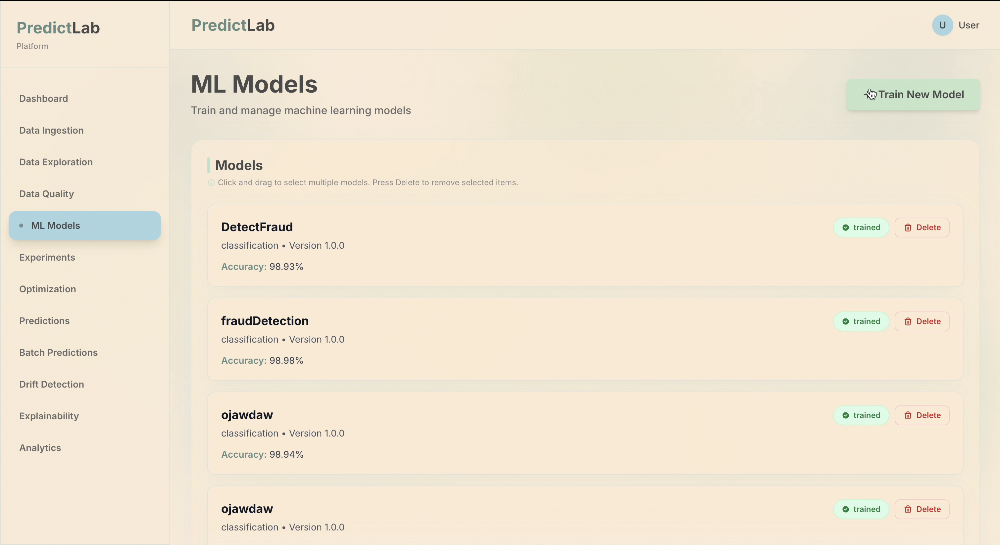
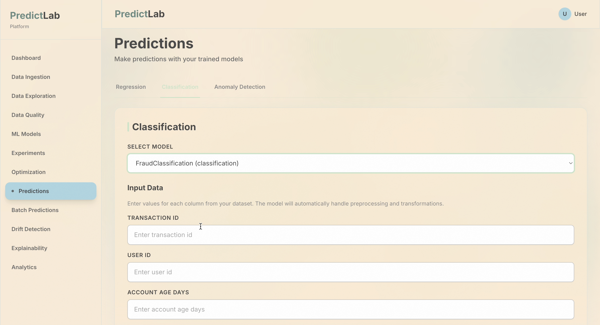
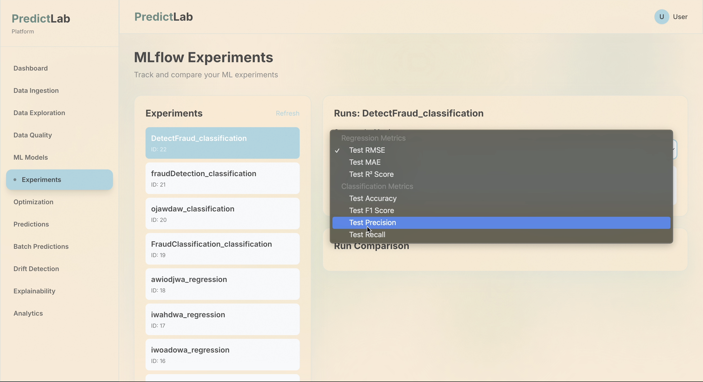
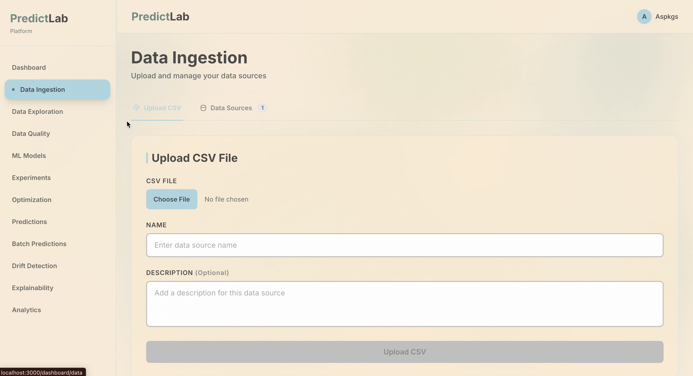
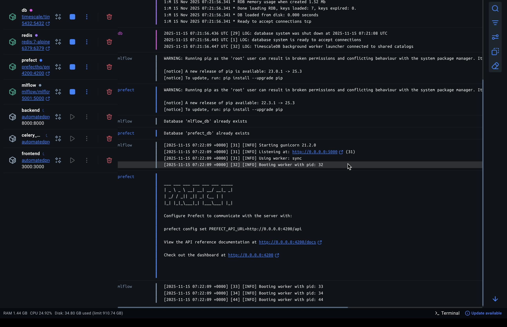

# Automated Predictive Modeling Platform

> Full-stack AutoML platform covering the complete ML lifecycle — data ingestion, automated preprocessing, model training across 5 algorithms, real-time explainability (SHAP/LIME), data drift monitoring, and experiment tracking.

[](https://nextjs.org/)
[](https://fastapi.tiangolo.com/)
[](https://typescriptlang.org/)
[](https://postgresql.org/)
[](https://redis.io/)
[](https://docker.com/)
[](https://scikit-learn.org/)
[](https://automated-predictive-modeling.vercel.app/)

**[Live Demo](https://automated-predictive-modeling.vercel.app/)** &nbsp;·&nbsp; **[API Docs](https://automated-predictive-modeling.vercel.app/docs)**

> **Demo note:** Hosted on free-tier Render — the backend may take 30–45 seconds to cold-start. Background features (async training, WebSocket updates) require paid infrastructure (Redis + Celery workers) not provisioned in the demo environment.

---

## Screenshots

<p align="center">
  
  
</p>
<p align="center">
  
  
</p>
<p align="center">
  
  
</p>

<details>
<summary>More screenshots</summary>
<br>
<p align="center">
  
  
</p>
<p align="center">
  
  
</p>
<p align="center">
  
</p>
</details>

---

## Architecture

```
┌─────────────────────────────────────────────────────────────────┐
│  Frontend  (Next.js 14 · TypeScript · Tailwind · Recharts)      │
│  App Router · React Context · WebSocket client · Framer Motion  │
└───────────────────────┬─────────────────────────────────────────┘
                        │ REST + WebSocket
┌───────────────────────▼─────────────────────────────────────────┐
│  API Layer  (FastAPI · Pydantic · JWT auth · Rate limiting)      │
│  OpenAPI docs · API key management · Prometheus metrics          │
└──────┬─────────────────────────────┬────────────────────────────┘
       │ Sync queries                │ Async tasks
┌──────▼──────────┐        ┌─────────▼──────────────────────────┐
│  PostgreSQL 15  │        │  Celery Workers + Redis Broker      │
│  + TimescaleDB  │        │  Model training · Batch processing  │
│  SQLAlchemy ORM │        │  Drift checks · Retraining pipelines│
└─────────────────┘        └─────────────────────────────────────┘
       │                            │
┌──────▼────────────────────────────▼─────────────────────────────┐
│  ML Layer                                                        │
│  scikit-learn · XGBoost · CatBoost · LightGBM                   │
│  Optuna (HPO) · MLflow (experiment tracking)                     │
│  SHAP · LIME (explainability) · Evidently (drift detection)      │
└──────────────────────────────────┬──────────────────────────────┘
                                   │ Artifacts
                        ┌──────────▼──────────┐
                        │  Cloud Storage       │
                        │  AWS S3 / Azure Blob │
                        └─────────────────────┘
```

---

## Key Features

### ML Pipeline
- **5 algorithms** — Random Forest, XGBoost, CatBoost, LightGBM, Neural Networks
- **Automated preprocessing** — missing value imputation, encoding, scaling, feature engineering
- **Hyperparameter optimization** — Optuna with grid, random, and TPE search strategies
- **Async training jobs** — Celery workers with real-time WebSocket progress updates
- **Model versioning** — artifact storage on S3/Azure with full metadata tracking

### Observability & Explainability
- **SHAP** — waterfall charts, feature importance, global model explanations
- **LIME** — local instance-level explanations for any prediction
- **Data drift detection** — statistical tests (KS, PSI) with automated alerts
- **Data quality profiling** — lineage tracking, schema validation, distribution reports
- **Experiment tracking** — MLflow integration for comparing runs and hyperparameters

### Production-Grade Infrastructure
- **JWT authentication** — access + refresh token rotation
- **Rate limiting** — Redis-backed per-user request throttling
- **REST API** — 40+ endpoints with full OpenAPI documentation
- **Batch processing** — async CSV ingestion with job status polling and result download
- **A/B testing framework** — compare deployed model versions in production
- **Alert system** — configurable thresholds for model performance degradation
- **Docker Compose** — single-command local setup for the full stack

---

## Tech Stack

| Layer | Technologies |
|---|---|
| **Frontend** | Next.js 14 (App Router), TypeScript, Tailwind CSS, Recharts, Framer Motion |
| **Backend** | FastAPI, Pydantic v2, SQLAlchemy, Alembic, Uvicorn |
| **ML / AI** | scikit-learn, XGBoost, CatBoost, LightGBM, SHAP, LIME, Optuna, MLflow |
| **Database** | PostgreSQL 15 + TimescaleDB, Redis |
| **Async** | Celery, WebSockets |
| **Auth** | JWT (access + refresh tokens), API key management |
| **Storage** | AWS S3 / Azure Blob Storage |
| **DevOps** | Docker, Docker Compose, Vercel (frontend), Render (backend) |

---

## Local Development

**Prerequisites:** Docker + Docker Compose

```bash
git clone https://github.com/Phantomjkk/Predictive-Modeling-Automation.git
cd Predictive-Modeling-Automation

# Copy and configure environment variables
cp backend/.env.example backend/.env

# Start the full stack (API + DB + Redis + Celery + Frontend)
docker compose up --build
```

| Service | URL |
|---|---|
| Frontend | http://localhost:3000 |
| Backend API | http://localhost:8000 |
| API Docs (Swagger) | http://localhost:8000/docs |
| MLflow UI | http://localhost:5000 |

---

## API Overview

40+ REST endpoints organized across 10 domains:

`Authentication` · `Data Ingestion` · `ML Models` · `Predictions` · `Batch Processing` · `Explainability` · `Experiments` · `Hyperparameter Optimization` · `Drift Detection` · `Data Quality`

Full interactive documentation available at `/docs` (Swagger UI) or `/redoc` when the backend is running.

---

## Deployment

| Component | Platform | Notes |
|---|---|---|
| Frontend | Vercel | Auto-deploy from `main` |
| Backend API | Render | Dockerized FastAPI |
| Database | Render PostgreSQL | Managed instance |
| Background workers | Self-hosted | Redis + Celery (not in free-tier demo) |
| Model artifacts | AWS S3 / Azure Blob | Configurable via env vars |
